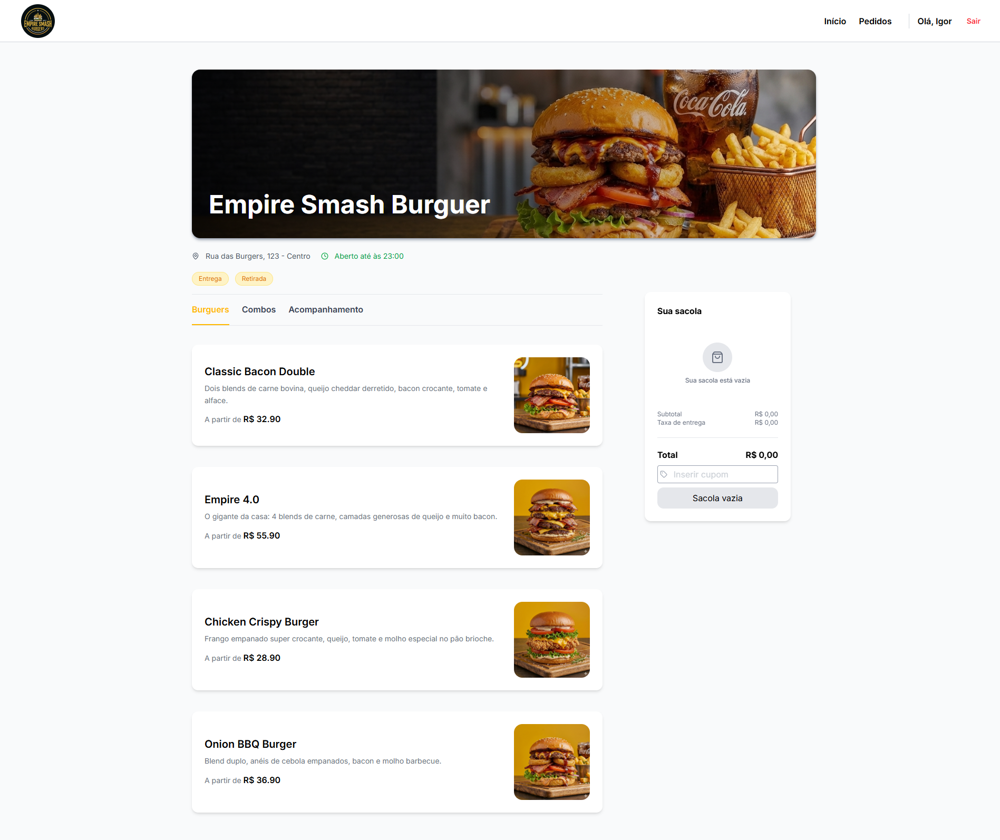
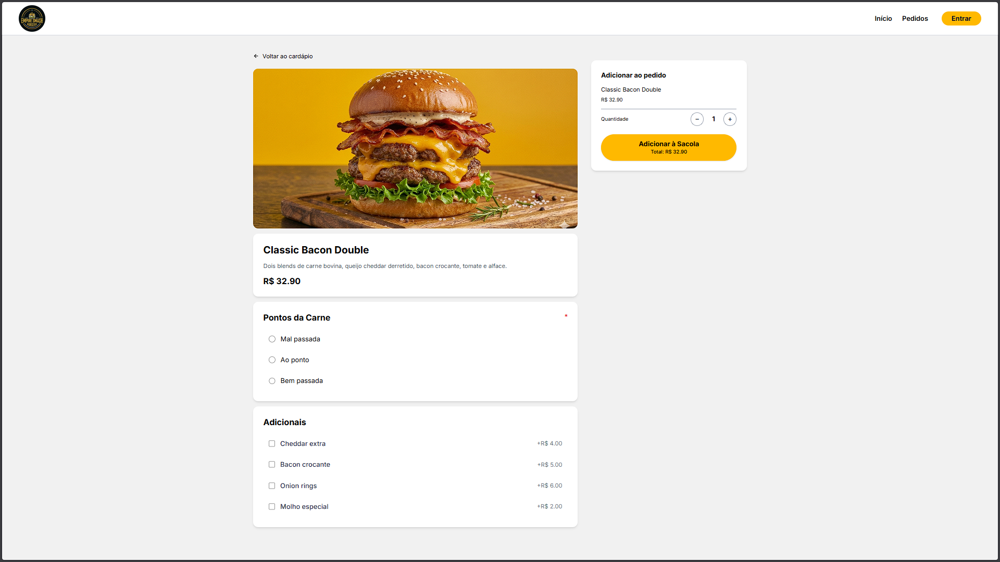
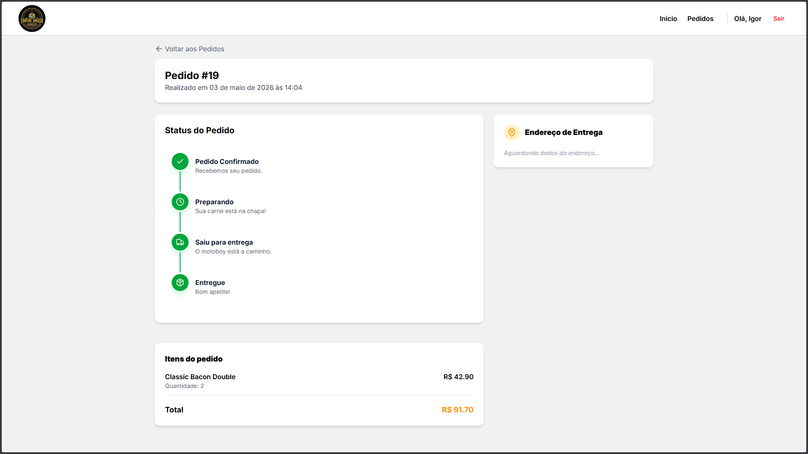

# 🍔 Empire Smash Burgers - Sistema de Pedidos e Cardápio Digital

Bem-vindo ao repositório do **Empire Smash Burgers**! Este é um projeto Full-Stack focado no Front-end que simula o ecossistema completo de uma hamburgueria moderna. Desde a escolha do lanche até o acompanhamento em tempo real da entrega, a aplicação foi desenhada para oferecer uma Experiência de Usuário (UX) impecável, inspirada nos principais aplicativos de delivery do mercado.


## 📌 Sumário
- [Funcionalidades](#-funcionalidades)
- [Tecnologias Utilizadas](#-tecnologias-utilizadas)
- [Arquitetura e Destaques Técnicos](#-arquitetura-e-destaques-técnicos)
- [Demonstração Visual](#-demonstração-visual)
- [Como Executar o Projeto](#-como-executar-o-projeto)
- [Configuração do Banco de Dados](#-configuração-do-banco-de-dados-supabase)
- [Autor](#-autor)

---

## 🚀 Funcionalidades

- **Cardápio Dinâmico:** Listagem de produtos dividida por categorias (Burguers, Combos, Acompanhamentos) com renderização otimizada.
- **Customizador de Produtos:** Seleção de "Ponto da Carne" e adição de "Extras" (Bacon, Cheddar, etc.) com cálculo dinâmico de preços.
- **Gerenciamento de Sacola:** Uso de Context API para adicionar itens, alterar quantidades, editar customizações de itens já na sacola e calcular o total do pedido.
- **Checkout e Histórico:** Criação de pedidos vinculados ao usuário autenticado.
- **Rastreamento em Tempo Real (Realtime):** Integração com WebSockets do Supabase. A tela de acompanhamento reage instantaneamente às mudanças de status no banco de dados.
- **Simulador de Linha de Produção:** Lógica inteligente com `useEffect` e `setTimeout` que simula o fluxo de uma cozinha, avançando o status do pedido automaticamente (Aguardando ➔ Preparando ➔ A Caminho ➔ Entregue).
- **Design Responsivo (Mobile-First):** Layout construído com Tailwind CSS garantindo fluidez em celulares, tablets e desktops.

---

## 🛠️ Tecnologias Utilizadas

### Front-end
- **[React](https://reactjs.org/) + [Vite](https://vitejs.dev/):** Biblioteca principal e bundler ultrarrápido.
- **[TypeScript](https://www.typescriptlang.org/):** Tipagem estática para maior segurança e previsibilidade do código.
- **[Tailwind CSS](https://tailwindcss.com/):** Estilização utilitária para construção rápida e consistente de interfaces.
- **[React Router](https://reactrouter.com/):** Navegação entre as páginas da aplicação.
- **[Lucide React](https://lucide.dev/):** Biblioteca de ícones moderna e leve.
- **[Sonner](https://sonner.emilkowal.ski/):** Sistema de notificações (toasts) elegante e acessível.

### Back-end & BaaS
- **[Supabase](https://supabase.com/):** Banco de dados PostgreSQL, Autenticação de Usuários e sistema Realtime.

---

## 🧠 Arquitetura e Destaques Técnicos

Este projeto não é apenas uma interface bonita; ele resolve problemas reais de engenharia de software no Front-end:

1. **Sincronização Assíncrona e Prevenção de Memory Leaks:** 
   No simulador de pedidos, foram implementadas rotinas de `setTimeout` dentro de `useEffect` com rigoroso uso de funções de limpeza (`clearTimeout`) para evitar vazamentos de memória na desmontagem dos componentes.
2. **Desestruturação de Dependências:**
   Aplicação de boas práticas do ESLint, desestruturando objetos antes de passá-los para arrays de dependências de Hooks, evitando re-renderizações infinitas.
3. **Z-Index e Stacking Context:**
   Resolução de conflitos de camadas no CSS para garantir que elementos pegajosos (`sticky`) e botões flutuantes (Sacola) se sobreponham de forma correta e amigável em dispositivos móveis.

---

## 📱 Demonstração Visual

*(Adicione suas capturas de tela dentro da pasta `/docs` do repositório)*

| Tela Inicial (Cardápio) | Customização do Lanche | Acompanhamento (Realtime) |
| :---: | :---: | :---: |
|  |  |  |

---

## ⚙️ Como Executar o Projeto

Para rodar este projeto localmente, você precisará do [Node.js](https://nodejs.org/) instalado em sua máquina.

1. **Clone o repositório:**
   ```bash
   git clone [https://github.com/seu-usuario/empire-smash-burgers.git](https://github.com/seu-usuario/empire-smash-burgers.git)
   cd empire-smash-burgers

2. **Instale as dependências:**
    ```bash
    npm install
    
3. **Configure as variáveis de ambiente:**
    Crie um arquivo .env na raiz do projeto com as seguintes chaves:
    ```Snippet de código
        VITE_SUPABASE_URL=sua_url_do_supabase
        VITE_SUPABASE_ANON_KEY=sua_chave_anonima_do_supabase

4. **Inicie o servidor de desenvolvimento:**
      ```Bash
         npm run dev

**Banco de Dados e Segurança**
  A infraestrutura utiliza o Supabase para persistência de dados.
  
  - Realtime: Habilitado para a tabela de pedidos, permitindo que o cliente receba atualizações de status sem recarregar a página.
  
  - Row Level Security (RLS): Políticas configuradas para garantir que usuários acessem apenas os dados permitidos, mantendo a integridade do sistema.
  
  ⚠️ **Desafios Técnicos**
  - Sincronização de Estado: Manter o carrinho consistente entre diferentes sessões e garantir que atualizações de quantidade não dupliquem itens com customizações distintas.
  
  - Concorrência em Tempo Real: Lidar com mudanças de status no banco de dados e refletir na UI de forma instantânea sem causar conflitos de interface.
  
  - Lógica de Efeitos Colaterais: Controle rigoroso de chamadas assíncronas para evitar estados inconsistentes durante a transição de telas.

👨‍💻 **Autor**
Igor Vinicius Gonçalves da Silva
Estudante de Análise e Desenvolvimento de Sistemas/ Desenvolvedor FullStack

🔗 **Links**
**[Demo](https://empire-smash-burguer.vercel.app/)**

**[Repositório GitHub](https://github.com/IgorViniciusG/EmpireSmashBurguer)**
      
